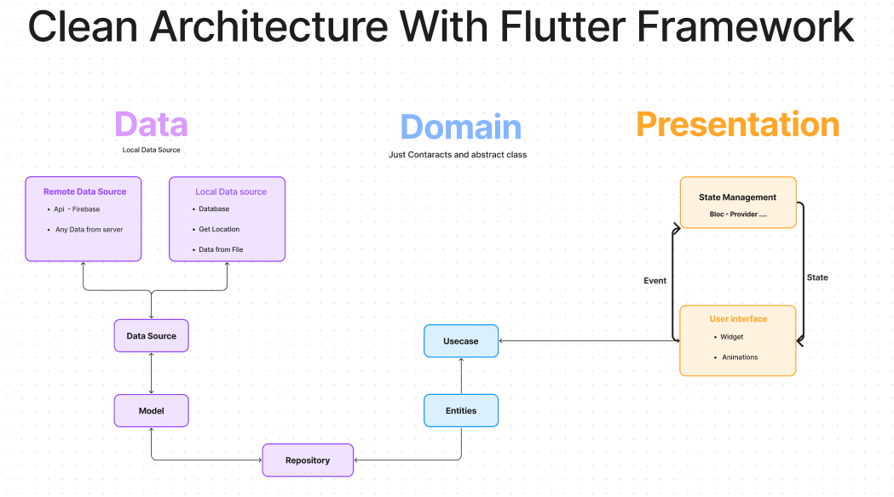

 # 1 -  domain layer -->
    ##contract layer --> just contract and abstract class

     // 1 -->  entity  --> model without fsctory
     //  2 --> repository    --> abstract class BaseWeatherRepo --> 
      put all methods here
     // 3 -> usecase       --> bridge    contract with presentation
 

# 2  data layer

    // 1 models     --> put model with factory -->return entity from api
    // 2 data source -> put method that send request 
    // 3 repository --> implementation for repo in domain

#  3 presentation 
     // 1 get usecase 

